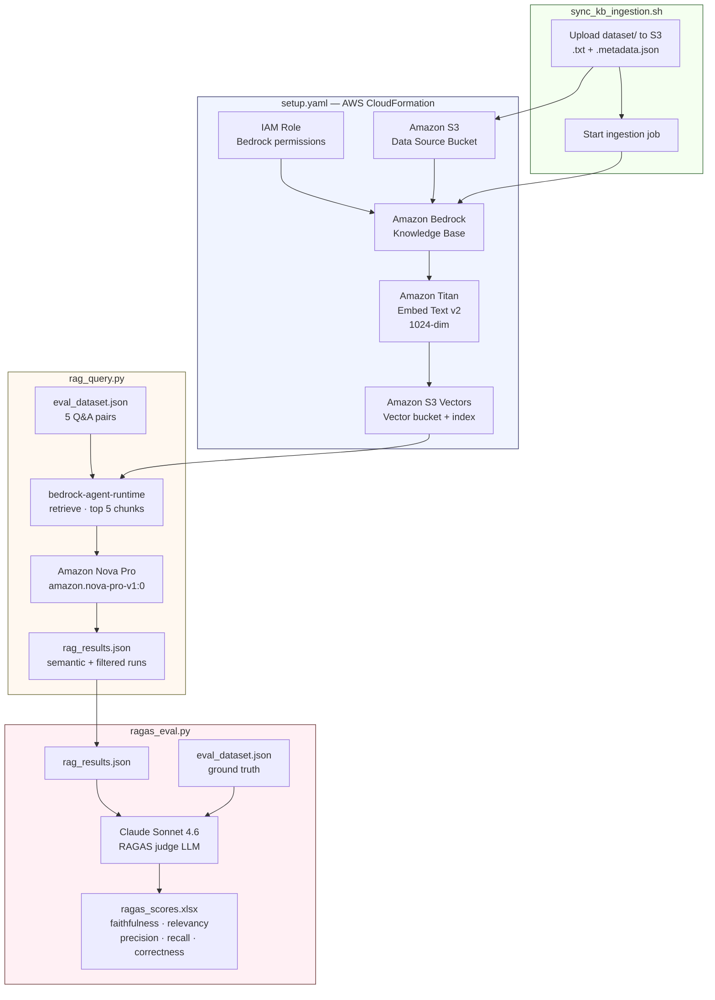

# Build a RAG Evaluation Pipeline Using RAGAS with Amazon Bedrock Knowledge Bases and Amazon S3 Vectors

This repository provides a complete RAG evaluation pipeline built on [Amazon Bedrock](https://aws.amazon.com/bedrock/) Knowledge Bases, [Amazon S3 Vectors](https://docs.aws.amazon.com/AmazonS3/latest/userguide/s3-vectors.html), and the [RAGAS](https://docs.ragas.io/) evaluation framework. The pipeline retrieves documents from a Bedrock Knowledge Base, generates answers with [Amazon Nova Pro](https://aws.amazon.com/ai/generative-ai/nova/), and evaluates the outputs across five metrics using Claude Sonnet 4.6 as the judge LLM.

The domain is 95 peer-reviewed PubMed abstracts on chronic low back pain. Two retrieval modes are compared: semantic (full corpus) and metadata-filtered (2025 papers only). The evaluation produces a side-by-side score comparison exported to an Excel file.

This repository accompanies the blog post [Build a RAG Evaluation Pipeline Using RAGAS with Amazon Bedrock Knowledge Bases and Amazon S3 Vectors](https://substack.com/@vcorreacom/note/p-190244021?r=7uj33o&utm_source=notes-share-action&utm_medium=web). Refer to the blog post for architecture decisions, metric analysis, and deeper implementation details.

## Architecture Overview



### Key Components

1. **Infrastructure** (CloudFormation)

   - S3 bucket for source documents
   - S3 Vector bucket and index (1024 dimensions, cosine distance, float32)
   - Amazon Bedrock Knowledge Base with Titan Embed Text v2
   - IAM role with minimum required permissions

2. **RAG Query Pipeline** ([rag_query.py](rag_query.py))

   - Separate retrieve and generate calls via boto3
   - Semantic and metadata-filtered retrieval modes
   - Amazon Nova Pro as the generator

3. **RAGAS Evaluation** ([ragas_eval.py](ragas_eval.py))

   - Claude Sonnet 4.6 as the judge LLM via Amazon Bedrock
   - Five metrics: faithfulness, answer relevancy, context precision, context recall, answer correctness
   - Score comparison exported to `ragas_scores.xlsx`

## Prerequisites

- An AWS account with valid credentials configured locally
- AWS CLI installed and working (`aws sts get-caller-identity` should succeed)
- Python 3.10 or later
- Amazon Bedrock model access enabled in your target region for Amazon Nova Pro, Amazon Titan Embed Text v2, and Claude Sonnet 4.6

The repository assumes your AWS identity has permissions for CloudFormation, IAM, S3, Amazon Bedrock Knowledge Bases, and S3 Vectors.

### AWS authentication

AWS documents a few common ways to authenticate the CLI and SDKs used in this repository.

- **IAM Identity Center** (recommended for human users working from a local machine). [AWS CLI documentation](https://docs.aws.amazon.com/cli/latest/userguide/cli-configure-sso.html)
- **IAM user access keys** (commonly configured with `aws configure`). [AWS CLI reference](https://docs.aws.amazon.com/cli/latest/reference/configure/)
- **IAM users overview**. [Documentation](https://docs.aws.amazon.com/IAM/latest/UserGuide/id_users.html)

In practice, as long as `aws` CLI commands work and `boto3` can resolve credentials, the steps below will work.

```bash
aws sts get-caller-identity
```

If that fails, fix authentication before continuing.

## Deployment Guide

### 1. Deploy the infrastructure

Choose a region and deploy the CloudFormation stack.

```bash
REGION=eu-west-2

aws cloudformation deploy \
  --template-file setup.yaml \
  --stack-name clbp-rag-stack \
  --capabilities CAPABILITY_NAMED_IAM \
  --region "$REGION"
```

This creates the resources defined in [setup.yaml](setup.yaml).

### 2. Upload the dataset and start ingestion

Run the sync helper after the stack finishes deploying.

```bash
bash sync_kb_ingestion.sh
```

By default, the script uses stack name `clbp-rag-stack`, region `eu-west-2` (unless `REGION` is already exported), docs directory `dataset`, and S3 prefix `clbp`. You can pass custom values.

```bash
bash sync_kb_ingestion.sh <stack-name> <region> <docs-dir> <s3-prefix>
```

When the script completes, it prints the Bedrock Knowledge Base ID. Save that value for step 4.

### 3. Create a Python environment and install dependencies

```bash
python3 -m venv .venv
source .venv/bin/activate
pip install -r requirements.txt
```

### 4. Run the RAG pipeline

Run [rag_query.py](rag_query.py) with the same region and the Knowledge Base ID from step 2.

```bash
python rag_query.py <region> <kb_id>
```

Example:

```bash
python rag_query.py eu-west-2 ABCDE12345
```

The script loads `eval_dataset.json`, retrieves chunks from the Bedrock Knowledge Base, generates answers with Amazon Nova Pro, runs both semantic and filtered retrieval modes, and writes the combined output to `rag_results.json`.

### 5. Run the RAGAS evaluation

```bash
python ragas_eval.py <region>
```

Example:

```bash
python ragas_eval.py eu-west-2
```

The script loads `rag_results.json`, evaluates both runs with RAGAS, writes the score comparison to `ragas_scores.xlsx`, and prints a summary table in the terminal.

## Expected Output

After a full run, the main outputs are:

- `rag_results.json`. Generated answers and retrieved contexts for both retrieval modes.
- `ragas_scores.xlsx`. Evaluation scores and summary comparison.

### Typical end-to-end flow

```bash
REGION=eu-west-2

aws cloudformation deploy \
  --template-file setup.yaml \
  --stack-name clbp-rag-stack \
  --capabilities CAPABILITY_NAMED_IAM \
  --region "$REGION"

bash sync_kb_ingestion.sh

python3 -m venv .venv
source .venv/bin/activate
pip install -r requirements.txt

python rag_query.py <region> <kb_id>
python ragas_eval.py <region>
bash cleanup_kb_stack.sh
```

## Cleanup

When you are done, delete the resources created for this project.

```bash
bash cleanup_kb_stack.sh
```

By default, the cleanup script targets stack name `clbp-rag-stack`, region `eu-west-2` (unless `REGION` is already exported), and project name `clbp-rag`. You can pass custom values.

```bash
bash cleanup_kb_stack.sh <stack-name> <region> <project-name>
```

The script performs best-effort cleanup of the Bedrock data source, Knowledge Base, S3 Vectors index, S3 Vectors bucket, S3 data source bucket, IAM role, and the CloudFormation stack.

> **Warning.** Always verify in the AWS console or CLI that all resources were actually deleted. Some AWS deletions are asynchronous, and retained or service-managed resources can occasionally require manual follow-up.

## Notes

- Use the same AWS region throughout the workflow.
- The ingestion step may take some time depending on service state and dataset size.
- If Bedrock model access is restricted in the target account or region, the query or evaluation steps will fail until access is enabled.
- After cleanup, confirm that the Bedrock Knowledge Base, S3 Vectors resources, S3 bucket, IAM role, and CloudFormation stack are gone.


## License

This library is licensed under the MIT-0 License. See the LICENSE file.
